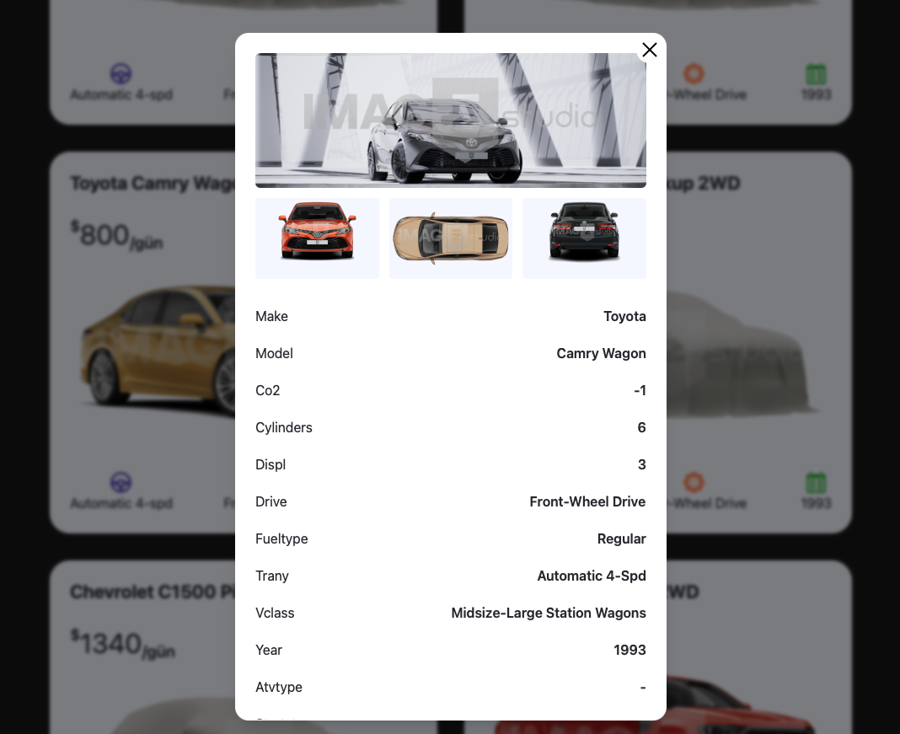
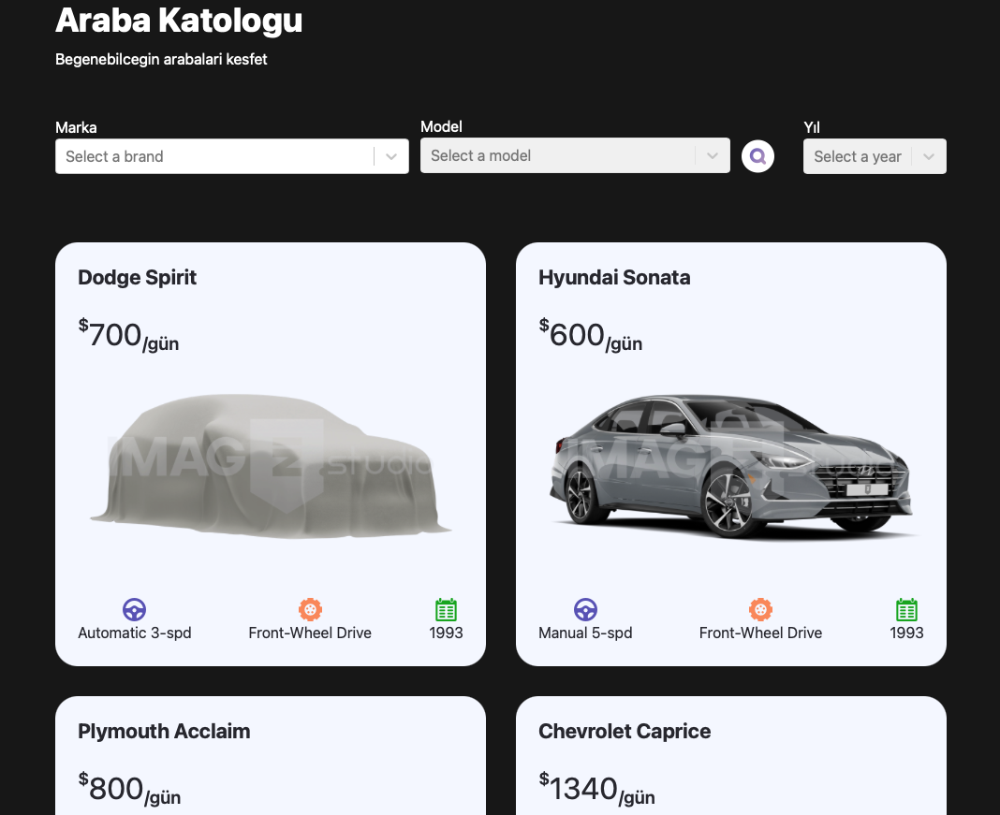

# 🚗 Car Rental App

> "Hayalinizdeki aracı bulmanın en kolay yolu!"

Modern ve kullanıcı dostu bir araç kiralama uygulaması. Saniyeler içinde binlerce araç arasından seçim yapın, filtreleyin ve hayalinizdeki araca kavuşun! 🎯






## ✨ Öne Çıkan Özellikler

- 🚗 **Akıllı Filtreleme**: Marka, model ve yıl bazlı filtreleme ile aradığınız aracı saniyeler içinde bulun
- 🔍 **Gelişmiş Arama**: Sadece ne istediğinizi söyleyin, gerisini bize bırakın
- 📱 **Her Cihazda Mükemmel**: Telefondan tablete, her ekranda kusursuz deneyim
- ⚡ **Şimşek Hızında**: Optimize edilmiş performans ile anında sonuçlar
- 🎨 **Göz Alıcı Tasarım**: Modern ve şık arayüz ile keyifli bir kullanıcı deneyimi

## 🚀 Hızlı Başlangıç

```bash
# Projeyi klonlayın
git clone https://github.com/yourusername/car-rental.git

# Proje dizinine gidin
cd car-rental

# Bağımlılıkları yükleyin
npm install

# Geliştirme sunucusunu başlatın
npm run dev
```

## 🧪 Test Etme

```bash
# Testleri çalıştırın
npm test

# Watch modunda testleri çalıştırın
npm run test:watch
```

## 🛠️ Kullanılan Teknolojiler

- ⚛️ React - Modern UI geliştirme
- 📘 TypeScript - Tip güvenliği
- 🎨 Tailwind CSS - Hızlı ve responsive tasarım
- 🔄 React Select - Gelişmiş seçim arayüzü
- 📄 React Paginate - Akıllı sayfalama
- 🧪 Jest & Testing Library - Güvenilir test altyapısı

## 📁 Proje Yapısı

```
src/
  ├── components/     # UI bileşenleri
  ├── context/       # Context API
  ├── types/         # TypeScript tipleri
  ├── utils/         # Yardımcı fonksiyonlar
  └── App.tsx        # Ana uygulama bileşeni
```

## 🤝 Katkıda Bulunma

Projemize katkıda bulunmak ister misiniz? Harika! İşte adımlar:

1. 🍴 Fork'layın
2. 🌿 Feature branch oluşturun (`git checkout -b feature/amazing-feature`)
3. 💾 Değişikliklerinizi commit edin (`git commit -m 'feat: Add amazing feature'`)
4. 📤 Branch'inizi push edin (`git push origin feature/amazing-feature`)
5. 🔄 Pull Request oluşturun

> 💡 **İpucu**: Projeyi beğendiyseniz yıldız vermeyi unutmayın! ⭐
